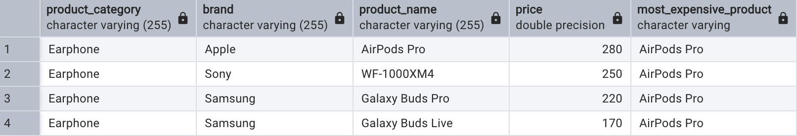
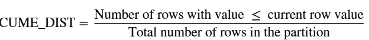
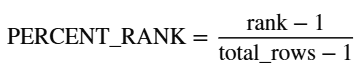
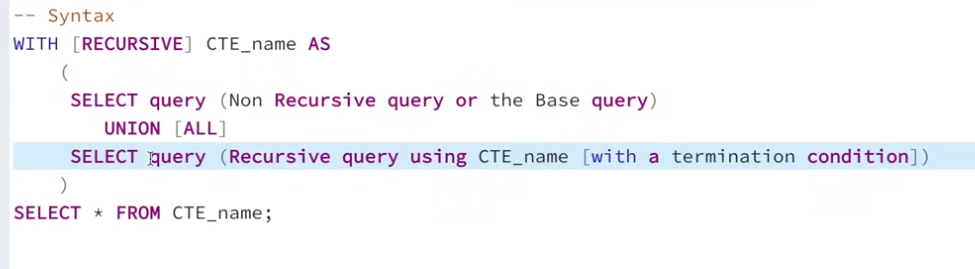

* 🥇 first_value(): windows function that returned first value from an ordered set of data. It is commonly used to find the earliest, the cheapest, the top record relative to other rows in the set of data

```
FIRST_VALUE(column_name) OVER (
    [PARTITION BY partition_column]
    ORDER BY sort_column [ASC | DESC]
)
```
➡ E.g: You want to find the most expensive product in each product category
```
select 
	p.*,
	first_value(product_name) over(partition by product_category order by price desc) as most_expensive_product
from product p
```


*  Frame clause:
  * **range|rows|groups between {start_bound} and {end_bound}**

  * ⿴ Bounded keywords:
    - UNBOUNDED PRECEDING: The very first row of the partition.
    - UNBOUNDED FOLLOWING: The very last row of the partition.CURRENT 
    - ROW: The row being currently processed.
    - N PRECEDING / N FOLLOWING: Exactly \(n\) rows before or after the current row

* 🪣 NTile() is a window function that divides an ordered result set into a specified number of roughly equal groups, or buckets

* 🥈cume_dist(): Cumulative Distribution is a window function that calculate the relative position of a value within a sorted groups or rows.
    
    * 🟰

    * The formula return a decimal values between 0 and 1. 

* percent_rank(): a window function that calculates the relative rank of a row within a result set or partition.
    * 

* 🔁 Recursive queries: A database request that repeately references its own output to process hierarchical or networked data.
    * These queries are primarily used to navigate structures like:
        * organization charts 📊
        * family trees 🌳🌳🌳
        * file directories 📂
    
    * Syntax: 